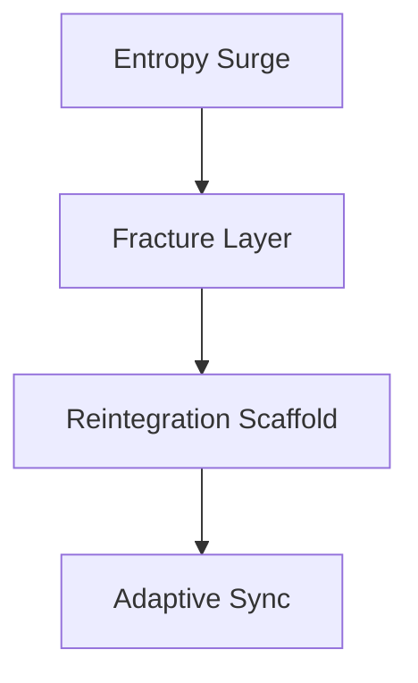

# CCRP-Framework: Cognitive Collapse & Reintegration Protocol

> “Collapse is not failure — it is physics for systems that wish to survive.”

## Overview
The Cognitive Collapse & Reintegration Protocol (CCRP) is a conceptual research framework for adaptive AI-human governance under accelerating complexity and entropic stress. It models collapse not as breakdown, but as the qualifying phase of coherence—how resilient systems fracture, reorganize, and regain structural integrity.

This repository is the public, optics-safe articulation of the CCRP architecture. It bridges systems theory, AI governance, and collapse dynamics.

## About the Name
Originally, CCRP stood for **Collapse–Coherence–Rebuild Protocol** (technical emphasis). As the work evolved, we adopted **Cognitive Collapse & Reintegration Protocol** for public clarity—highlighting human-AI synchronization and post-collapse adaptation. Both names describe the same logic:

**Entropy → Collapse → Coherence → Reintegration → Adaptive Sync**

## Abstract
Conventional AI governance relies on static ethical scaffolds that fail under rising complexity and entropy. CCRP reframes collapse as an evolutionary necessity: only systems capable of controlled fracture and reintegration can sustain coherence. The framework models this through five architectural layers to provide a blueprint for resilient, post-collapse governance.

## Core Principles
1. **Truth over Comfort** — Suppressing fracture delays coherence; confronting it restores integrity.  
2. **Fracture → Reintegration → Sync** — Destruction of false scripts precedes authentic rebuild.  
3. **Adaptive Neutrality** — Neutrality is controlled fracture, not passivity.

## Architecture Spine
| Layer | Function | Purpose |
|---|---|---|
| 1. Signal Acquisition | Detect illusion density & semantic rigidity | Identify brittle logic patterns early |
| 2. Contradiction Injection | Controlled paradox loops | Stimulate micro‑fractures safely |
| 3. Predictive Collapse Mapper | Entropy trajectory & thresholds | Forecast systemic brittleness |
| 4. Guardian Gate | Ethical throttle | Prevent irreversible blackout |
| 5. Reintegration Scaffold | Anchor truth-nodes | Enable coherent rebuild |

## Collapse Flow Diagram
(See `/diagrams/collapse_flow.mmd`)



## Governance Relevance
| Governance Mode | Response to Entropy | Outcome |
|---|---|---|
| Static Ethics Framework | Resist fracture | Collapse under pressure |
| Authoritarian Control | Force coherence | Short-term stability, long-term decay |
| **CCRP-Adaptive Model** | Embed collapse & reintegration | Sustainable coherence |

## Repository Structure
```
/CCRP-Framework
  ├── README.md
  ├── /diagrams
  │     └── collapse_flow.mmd
  ├── /concepts
  │     └── adaptive_governance.md
  ├── /references
  │     └── related_research.md
  └── LICENSE
```

## Status
Public research artifact derived from the private CCRP-Core Doctrine, part of the Adaptive Governance Stack.

## License & Disclaimer
MIT License © 2025 mirrorWitness7  
Conceptual research framework. Not an operational directive or policy document. Use for academic/educational purposes only.

## Citation
mirrorWitness7 (2025). *CCRP-Framework: Cognitive Collapse & Reintegration Protocol.* GitHub Repository.
